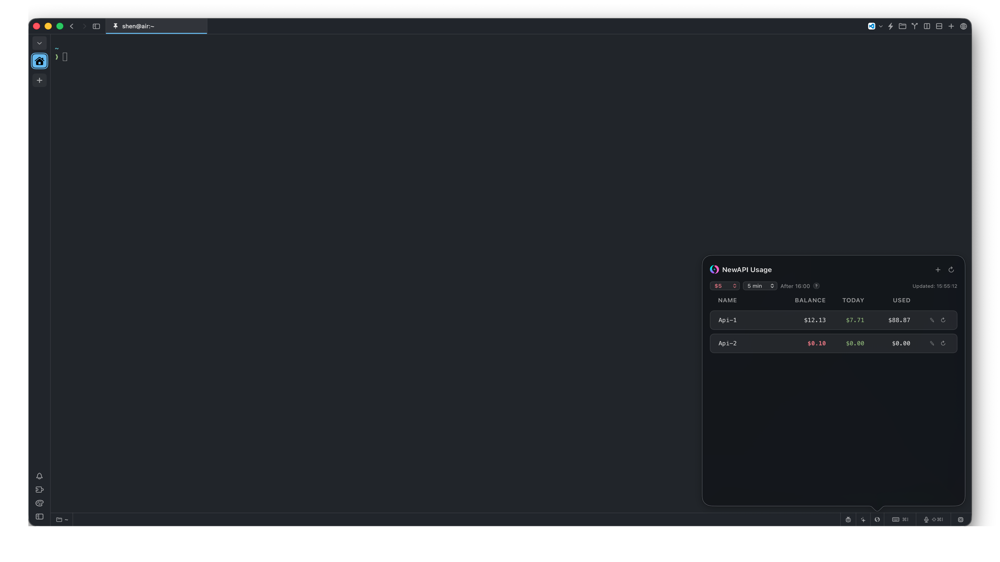

# API Usage

Multi-site NewAPI + Sub2API usage monitor for Muxy. Track NewAPI balance,
consumption, and Sub2API remaining balance/status from one status bar item.



## Features

- **One status bar item** — total balance across all compatible sites at a glance
- **Two site types** — choose **NewAPI** or **Sub2API** when adding a site
- **Grouped list** — sites are grouped by NewAPI and Sub2API sections
- **Type-aware editing** — NewAPI forms include User ID; Sub2API forms only
  require URL + token
- **Data migration** — existing local `sub2api-usage` sites can be merged into
  this extension's local storage
- **Multi-site management** — add, edit, delete, enable/disable multiple sites
- **Real-time data** — NewAPI balance/today/used; Sub2API balance/unit/status
- **Auto-refresh** — fetches fresh data on open if the interval has elapsed
- **Balance alert** — set a threshold; balances below it highlight in red
- **Per-site refresh** — refresh individual sites without touching others
- **Concurrent fetching** — all sites fetch simultaneously for fast updates
- **Drag & drop reorder** — rearrange sites by dragging the Name column
- **Number roll animation** — numeric values smoothly animate from old to new
- **Theme-aware** — follows Muxy's light/dark theme automatically

## APIs

### NewAPI

```http
GET <apiUrl>/api/user/self
Authorization: Bearer <access token>
New-Api-User: <user id>
```

Daily usage is fetched from `/api/data/self` for the current day.

### Sub2API

```http
GET <apiUrl>/v1/usage
Authorization: Bearer <access token>
```

Remaining balance is extracted with:

```js
const remaining =
  response?.remaining ?? response?.quota?.remaining ?? response?.balance;
const unit = response?.unit ?? response?.quota?.unit ?? "USD";
const isValid = response?.is_active ?? response?.isValid ?? true;
```

## Installation

1. Clone or download this repository
2. Run `npm install`
3. Run `npm run build`
4. In Muxy, open Extensions → Load Unpacked → select the `dist/` folder
5. Click **Reload** to activate

## Usage

1. Click the status bar icon to open the popover
2. Click **＋** and choose a site type:
   - **NewAPI** — URL, access token, and user ID
   - **Sub2API** — URL and access token
3. Each row shows a type badge on the left:
   - `N` = NewAPI
   - `S` = Sub2API
4. NewAPI rows show: **Balance**, **Today**, **Used**
5. Sub2API rows show: **Balance**, **Unit**, **Status**
6. **✎** — edit or delete a site using its own type-specific form
7. **↻** on each row — refresh that site only
8. **↻** in header — refresh all sites
9. **Bal** dropdown — set a low-balance warning threshold ($5–$100)
10. **Refresh** dropdown — set auto-refresh interval (1 min to 1 hour)
11. Drag the **Name** column to reorder sites
12. Toggle **Enabled** in the edit form to temporarily disable a site

## Permissions

| Permission | Reason |
| ----------- | -------- |
| `commands:exec` | Runs `curl` in the background |
| `panels:write` | Updates the status bar |
| `notifications:write` | Shows toast notifications |
| `storage:read` / `storage:write` | Persists site configs and cached data |

## Development

```bash
npm install
npm run dev    # Vite dev server
npm run build  # Production build
```

Built files go to `dist/`. After rebuilding, click **Reload** in Muxy Extensions.

## Project Structure

```text
├── package.json             — Manifest + dependencies + marketplace metadata
├── vite.config.js           — Vite config
├── scripts/
│   ├── build-background.mjs — Copies background.js + assets to dist/
│   └── copy-manifest.mjs    — Copies package.json to dist/
├── popover/
│   └── index.html           — Popover entry
├── src/
│   ├── background.js        — Background polling script
│   ├── popover/
│   │   └── usage.js         — Popover UI logic
│   ├── lib/
│   │   ├── dom.js           — DOM helper utilities
│   │   └── icons.js         — SVG icon helpers
│   ├── assets/
│   │   ├── icon.svg         — Extension icon
│   │   └── screenshot.png   — Marketplace screenshot
│   └── styles/
│       └── global.css       — Theme-aware styles
└── dist/                    — Build output (what Muxy loads)
```

## License

MIT
